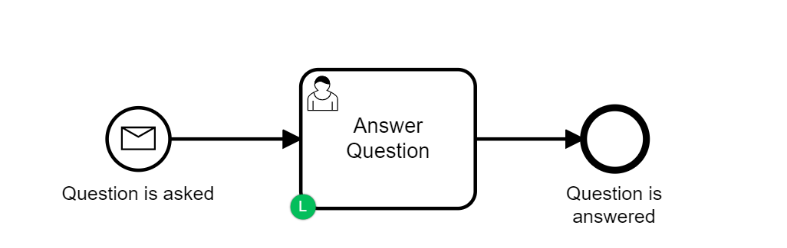
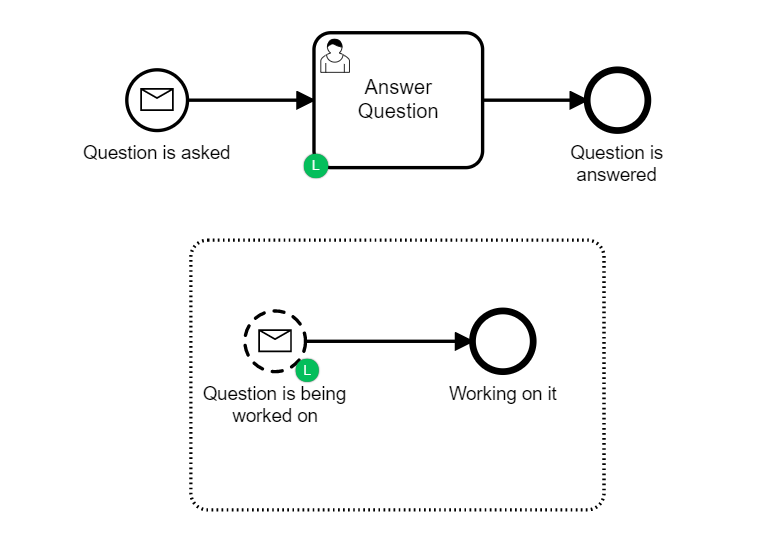

# Idempotent Camunda Process
 How to build a Camunda process that will only start one instance per request.
 This is quite a common requirements and I came across this quite nice pattern when working with a client. In the past people have tried to solve this problem by either over-riding the REST API or by messing around in the database. Personally I think this BPMN solution works really well.

 The process is really simple. A message ``Question`` is sent into the engine via the REST API. This will start an instance of a question answering process. There is a user task which is active until the question is answered at which point the process ends.

 

 In order to make it Idempotent we need to add an event based sub process which waits for the same ``Question`` message as the start event. This can be used to catch all messages after the first one. Making the event sub process non-interupting means that we can catch the message without affecting the ``Answer Question`` task.

 

 To start the process you make the following REST call from [Postman](https://www.postman.com/) or any REST client of your choice.

```
POST
http://localhost:8080/engine-rest/message

Content-Type : application/json
```
The body should be as follows:

```JavaScript
{
    "messageName": "Question",
    "businessKey": "1",
    "processVariables":
      	{
          "question" : {"value" : "Who is Garth Marenghi?", "type": "String"}
        },                 
    "all": false,
    "resultEnabled": true,
    "variablesInResultEnabled": true
}

```

The ``businessKey`` is the important part - There will only be one active process with that business key at any time.

The first time you send the request you'll get a ``200 OK`` back and you can check the returned variable ``status`` to see happening - it should say:

```JSON
"status": {
               "type": "String",
               "value": "Starting Work on the Question",
               "valueInfo": {}
           }
```       

If you send the same request again it will be caught by the event subprocess and you should get a ``200 OK`` and a different status.

```json
"status": {
    "type": "String",
    "value": "Still Working on the question",
    "valueInfo": {}
}
```
